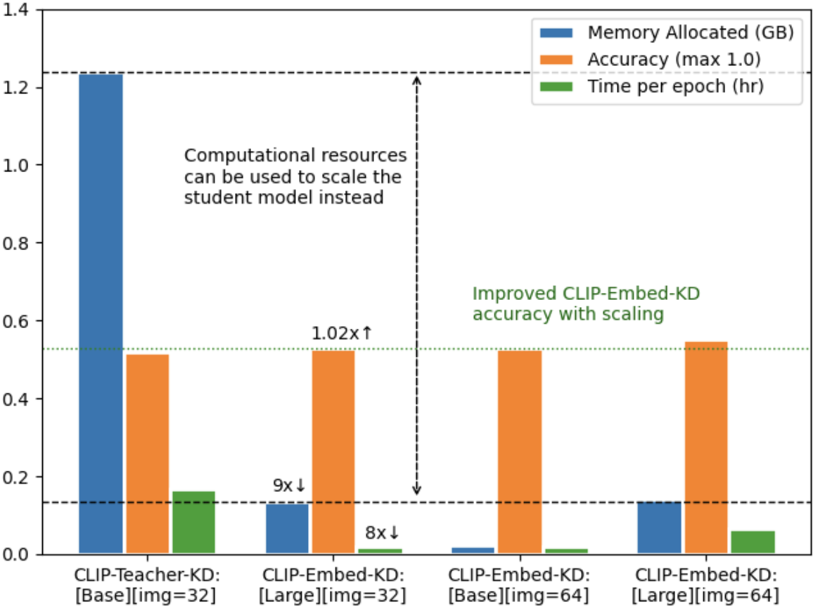

# CLIP-Embed-KD: Computationally Efficient Knowledge Distillation Using Embeddings as Teachers

**Short paper accepted to 28th IEEE High Performance Extreme Computing Conference (HPEC) 2024 -- Outstanding short paper award**

**Expanded paper available on arxiv:** [here](https://arxiv.org/abs/2404.06170)

*Can pre-computed embeddings obtained from the teacher model be used to train the student model in knowledge distillation?*

This project extends CLIP for efficient knowledge distillation, by utilizing embeddings as teachers. Typical knowledge distillation frameworks require running forward passes through a teacher model, which is often prohibitive in the case of billion or trillion parameter teachers. Using only the embeddings of the teacher models to guide the distillation can yield significant computational savings.

## RUNNING THE SCRIPT
Run the following command with appropriate arguments:

```
python train.py \
	--dataset-name <CIFAR10; CIFAR100; ImageNet> \
	--teacher-model <Huggingface-ckpt-name> \
	--log-folder <folder-to-save-logs> \
	--ckpt-save-name <name-of-ckpt-to-save-trained-model> \
	--train-type <embed-KD; teacher-KD; vanilla>
```

An example command for running the script is available in `train.sh`. The argument `train-type vanilla` refers to regular knowledge distillation (without using the CLIP distillation loss).

The argument `teacher-model` is the name of the HuggingFace checkpoint. Teacher models used in the paper include: `google/vit-large-patch16-224-in21k`, `google/vit-large-patch32-224-in21k`, `google/vit-base-patch16-224-in21k` and `google/vit-base-patch32-224-in21k`. The configuration of the student model, and other training parameters are in `config.py`.

### CLIP-Embed-KD: computational efficiency



### Pseudocode reference


## CITATION
If you find this work useful, please consider citing the paper:
```
@misc{nair2024clipembedkd,
      title={CLIP-Embed-KD: Computationally Efficient Knowledge Distillation Using Embeddings as Teachers}, 
      author={Lakshmi Nair},
      year={2024},
      eprint={2404.06170},
      archivePrefix={arXiv},
      primaryClass={cs.LG}
}
```
